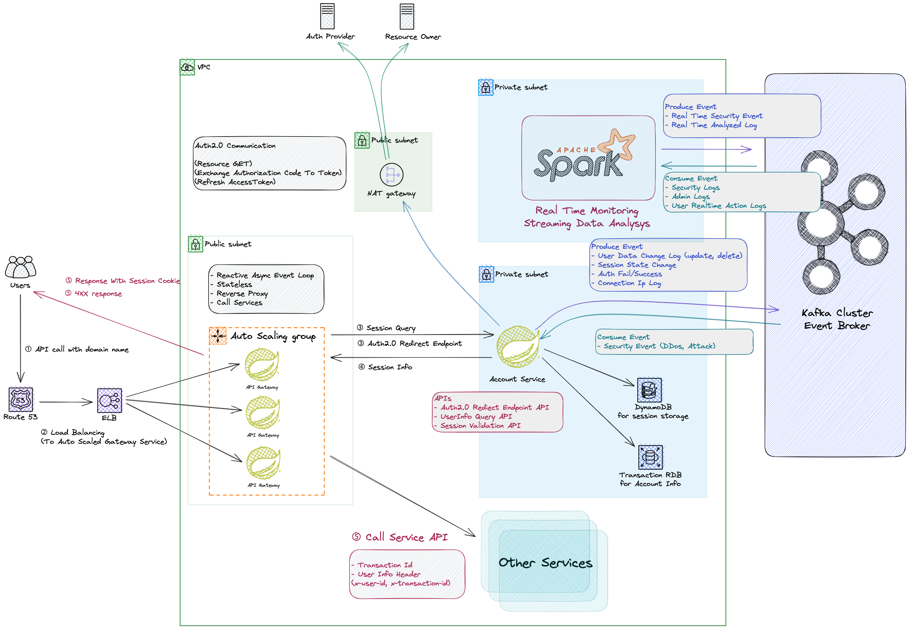

# Project - Managed Travel Service 🗺️

# ✏️ 서비스 소개
이 서비스는 추천 기반 여행 서비스 입니다.

- 사용자에게 여행 정보를 제공합니다.
- 사용자의 여행 계획을 편리하게 짤 수 있도록 시각화해줍니다.
- 사용자의 특성을 실시간으로 고려해서, 여행지를 추천해주고, 선택을 기반으로 최적의 경로를 작성해줍니다.

일단 개발의 우선도를 나눴습니다. 빨간색으로 표시된 블럭은 서비스의 핵심기능으로, 최우선적으로 개발될 기능입니다.

비어있는 블럭은 향후 서비스의 확장을 고려하기 위해 그려놓았으며, 향후 서비스의 성장 방향성을 보여줍니다.

# ✏️ System Design
이 파트에서는 이 서비스를 구현을 위한 소프트웨어적 설계를 다룹니다.

`Modular Monolith` -> `MSA` 프로젝트 진행에 따라 변환할 예정이고, 이를 전환을 고려하여 설계하였습니다. 

## Detail

### [System Design Detail - Modular Monolith](docs/readme/system_design/modular_design_detail.md)

### [Modular Monolith To MSA](docs/readme/system_design/modular_monolith_to_msa.md)

### [MSA Design Detail](docs/readme/system_design/msa_design_detail.md)

# ✏️ Event Design
`Event Driven Architecture` 로 의존성을 느슨하기 위해서는 이벤트 설계가 중요합니다. 

## Detail
### [Event Design Detail](docs/readme/system_design/event_design_detail.md)

# ✏️ Specification

## Account Domain
[Account Domain HTTP API](backend/account/specification/api_spec.md)

[Event Spec](backend/account/specification/event_spec.md)

[Database DDL](backend/account/infrastructure/database/account.sql)

# Major Versions
- kafka : 3.4.1 (confluent platform 7.4.3)
- spring boot : 3.1.4
- java : 17
- elasticsearch : 8.7.1
- spring data elasticsearch : 5.1.x
- postgresql : 16.0 with postgis extension
- hibernate core : 6.2.9