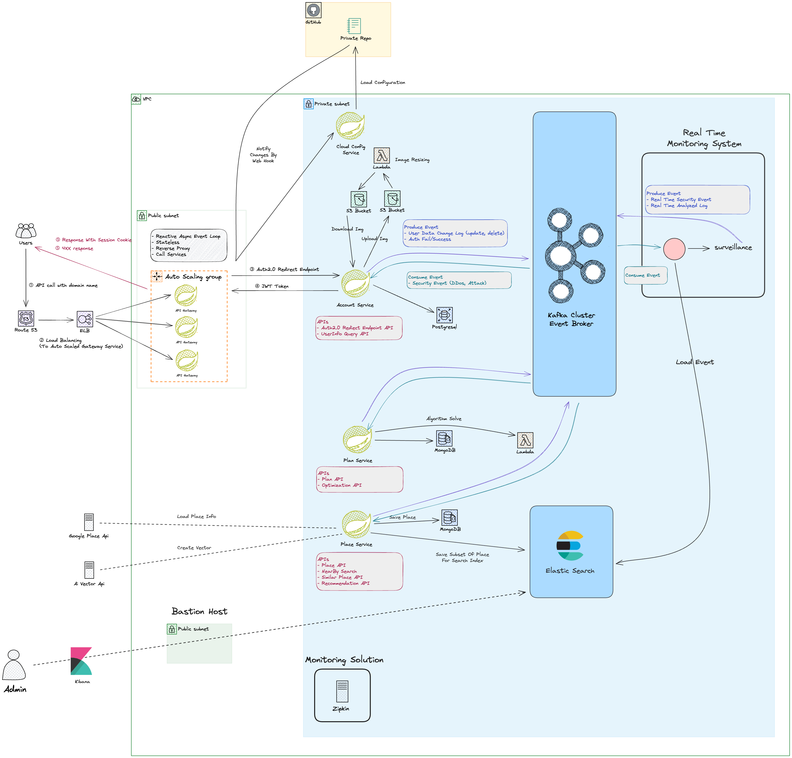

# Project - Managed Travel Service 🗺️

# ✏️ 서비스 소개
이 서비스는 추천 기반 여행 서비스 입니다.

## 주요 기능

일단 개발의 우선도를 나눴습니다. 빨간색으로 표시된 블럭은 서비스의 핵심기능으로, 최우선적으로 개발될 기능입니다.

## ERD

## 현재 아키텍쳐

## 모놀리스에서 MSA 로 전환 과정

[아키텍쳐 리팩토링 과정 문서](docs/readme/system_design/architecture_history.md)

# ✏️ Specification

## 이벤트 명 컨벤션 정의
### [Event Naming](docs/readme/system_design/event_design_detail.md)

## Account Domain
[Account Domain HTTP API](./backend/services/account/specification/api_spec.md)

[Event Spec](./backend/services/account/specification/event_spec.md)

[Database DDL](./backend/services/account/database/account.sql)

# Major Versions
- kafka : 3.4.1 (confluent platform 7.4.3)
- spring boot : 3.1.4
- java : 17
- elasticsearch : 8.7.1
- spring data elasticsearch : 5.1.x
- postgresql : 16.0 with postgis extension
- hibernate core : 6.2.9