# Project - Managed Travel Service 🗺️

# 서비스 소개
이 서비스는 추천 기반 여행 서비스 입니다.

- 사용자에게 여행 정보를 제공합니다.
- 사용자의 여행 계획을 편리하게 짤 수 있도록 시각화해줍니다.
- 사용자의 특성을 실시간으로 고려해서, 여행지를 추천해주고, 선택을 기반으로 최적의 경로를 작성해줍니다.

## 주요 내부 서비스 개요
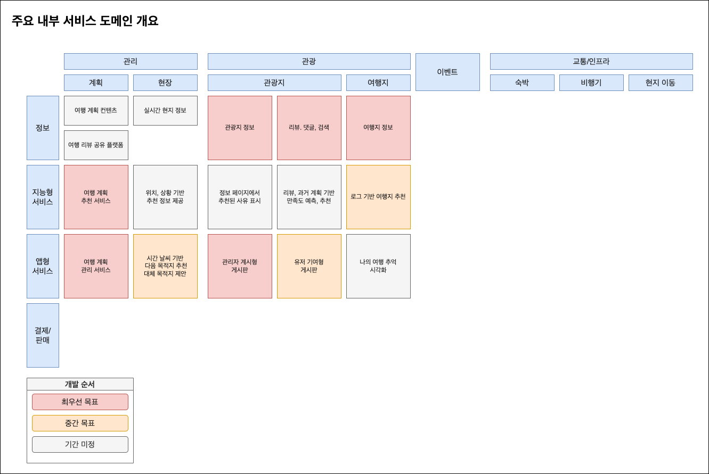
일단 개발의 우선도를 나눴습니다. 빨간색으로 표시된 블럭은 서비스의 핵심기능으로, 최우선적으로 개발될 기능입니다.

비어있는 블럭은 향후 서비스의 확장을 고려하기 위해 그려놓았으며, 향후 서비스의 성장 방향성을 보여줍니다.

# Architecture
이 파트에서는 이 서비스를 구현을 위한 소프트웨어적 설계를 다룹니다.

## 아키텍쳐 개요 - `Modular Monolith Architecture`
최근 인기가 많아진 MSA는 마치 완전히 선진화된 아키텍쳐 처럼 소개가 되고는 합니다. 하지만 그 의미에 대해 재 논의 하고자 합니다. 저의 오랜 생각에 기반한 내용입니다.

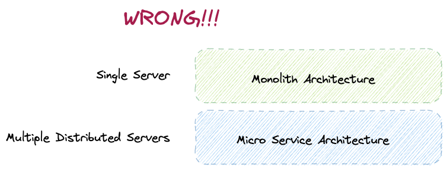

흔히들 착각 하는 것이 위 그림과 같습니다. 마치 하나의 서비스를 여러개의 분산된 서버에 작은 서비스로서 띄워놓은 것이 `마이크로 서비스 아키텍쳐`라고 생각을 합니다.

마치 모놀리스 아키텍쳐는 유지보수성이 좋지 못하고, 마치 오래된 레거시 취급을 합니다. 그리고 마이크로 서비스는 어렵지만 좋고 훌륭한 아키텍쳐로 많이들 생각을 합니다.

하지만 이런식으로 생각하는 것은 잘못되었다고 생각합니다. 우선 마이크로 서비스의 경우, 많은 장점 만큼이나 많은 단점들이 존재하고, 최근에 등장한 수많은 기술들(쿠버네티스, spring cloud 같이)이 이러한 마이크로 서비스에서의 다양한 어려움들을 말해주고 있습니다.

몇가지만 언급해보자면, 다음과 같습니다.
- 네트워크 비용 : 네트워크 비용은 공짜가 아닙니다. 이것은 단지 네트워크를 위해 지불하는 "돈" 만을 의미하지 않습니다.
- 운영 부담
- 복잡한 분산 처리에 대한 고려 : 서비스 디스커버리, 서킷브레이커, 멱등성 보장 등 분산 복잡한 분산 기술이 필요하고, 이는 초기 도입 비용을 증가시킵니다.

물론 여기서 말하려는 것은 마이크로 서비스 아키텍쳐가 안좋다 라는 말하려는 것이 아닙니다.

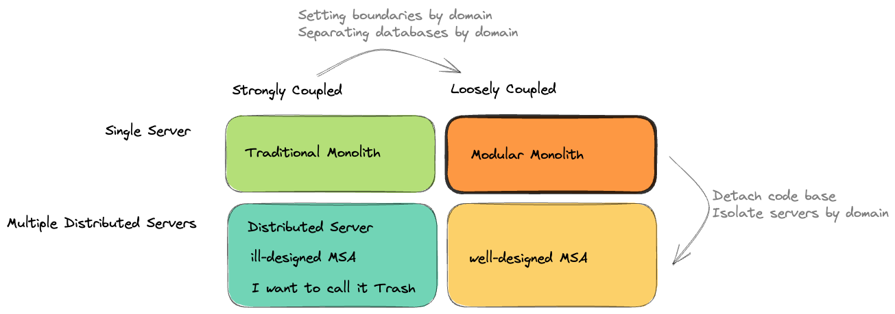

오히려 이런식의 개념 정립이 더 적절하다고 생각합니다.

마이크로 서비스에서의 핵심은 서버의 갯수가 아니라 도메인간의 의존성 분리라고 생각합니다. 오히려 저 의존성을 해결하지 못한 채 여러개의 서버로 분리만 진행했다면, 처참한 유지보수성에 네트워크 비용과 관리부담을 끼얹은 최악의 아키텍쳐가 완성되게 됩니다.

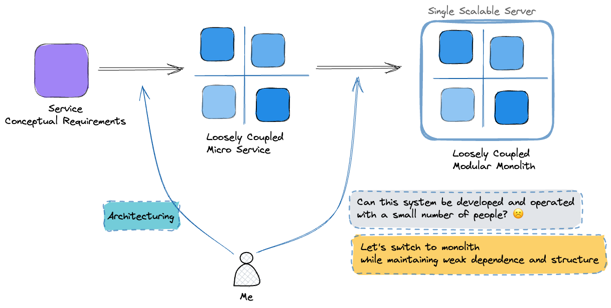

저는 이와 같은 생각 과정을 통해 이 모듈러 아키텍쳐(흔히 인터넷상에서 부르는, 저의 경우에는 Boundary Monolith 혹은 Loosly Coupled Monolith 라고 말하고 싶습니다.) 아키텍쳐를 생각하게 되었고, 저와 같은 생각을 가진 사람들을 찾아보던 중, 이들이 이런 아키텍처를 `Modular Monolith`라는 이름으로 부르고 있다는 것을 알게 되었습니다.

제가 구상한 이 아키텍쳐 (온라인에 있는 개념과 별개로 제가 처음 구상했을 때 목표)는 다음과 같습니다. 아래서 말하는 모듈러 모놀리스 아키텍쳐의 경우, 저의 구상을 기준으로 설명합니다. (Modular Monolith라는 온라인 명칭을 차용했을 뿐, 이 아키텍쳐의 설계는 저의 설계를 기준으로 설명합니다.)
- 단일 스프링 프로젝트에 각각의 도메인을 패키지를 기반으로 나눕니다.
- 각 패키지에서 공개하기로 명시한 인터페이스를 제외하고는 외부에서 절대 참조하거나 호출하지 못합니다.
- 인터페이스를 통해 스프링 컨테이너로 부터 DI를 받을 수 있게 됩니다.
- 따라서 해당 도메인에서는 구현체와 그 로직을 작성하여 스프링 컨테이너에 등록만 하면 됩니다.

가장 중요한 목표는 다음과 같습니다.
- 공개 인터페이스를 제외한 패키지(비공개 구현부분)를 `삭제`(말그대로 삭제)하더라도 다른 도메인의 코드를 고치지 않아도 되야 합니다.
- 이게 무슨말일까요? 즉 구현체 부분을 지우고 다른 구현체로 유연하게 대체할 수 있어야한다는 말입니다.
- 정해진 인터페이스만 공개되어 있기 때문에 가능한 일입니다.

각 도메인간 상호작용은 다음과 같은 형식으로 이루어 집니다.
- 인터페이스의 직접적 호출
  - 마이크로 서비스로의 전환시, Http나 grpc로 구현되면 됩니다.
  - 동기적이고 하나의 트랜잭션 안에서 처리되어야 하며, 정합성이 중요한 경우 호출됩니다.
  - 가능한 이 방법은 최소화 해야합니다
- 이벤트 기반 트리거 (이벤트 드리븐 아키텍쳐에 기반함)
  - 가능하면 이 방법을 통해 낮은 의존성을 유지해야합니다.
  - 비동기적이고 호출에 대한 결과값에 관심이 없어야합니다.
  - 이벤트가 호출대상이나 행동을 특정하면 안되고, 자신의 상태나 행동만을 정의해야합니다.

이벤트의 종류
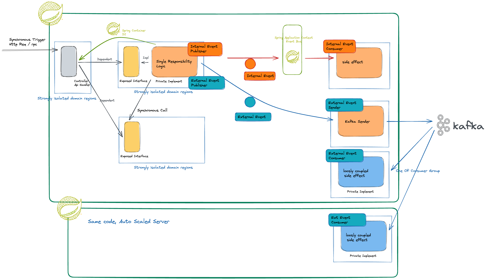

이벤트는 두가지로 나누었습니다.
- 스프링 자체의 Event Bus를 활용하는 이벤트
  - 하나의 서버 안에서 전체 로직이 처리됩니다.
  - 서버의 리소스를 공유합니다.
  - 원한다면 트랜잭션을 공유할 수도 있습니다.
  - 비동기로 처리할 수도 동기적으로 처리할 수도 있습니다.
  - 동기로 처리할시 높은 정합성을 유지할 수 있습니다.
- 외부 Kafka와 같은 이벤트 브로커를 활용하는 이벤트
  - 특정 인터페이스를 구현했는지 여부로 판단합니다.
  - 외부의 공통된 이벤트 저장소를 활용하므로, 결합도가 줄어들고, 분산처리의 장점을 얻을 수 있습니다.
  - 여유가 있는 컨슈머가 구독하여 작업을 처리할 수 있습니다.
  - 만약 한개의 서버가 작동을 멈춘다고 해도, 나머지 서버가 이 이벤트를 처리 할 수 있습니다.

이런 식으로 아키텍쳐를 설계하면 다음과 같은 장점이 있습니다.
- 스케일 업이 아닌 스케일 아웃으로 서비스를 확장할 수 있습니다.
- 각 로직이 매우 가벼워집니다.
- 도메인간 의존성이 매우 통제 가능해지며, 언제든 분리할 수 있습니다.
- 추후 서비스가 성장함에 따라 손쉽게 마이크로 서비스로 전환 할 수 있습니다. (구현체만 수정)

다음 그림은 전통적인 모놀리스와 제가 생각하는 `Modular Monolith`를 비교한 그림입니다.
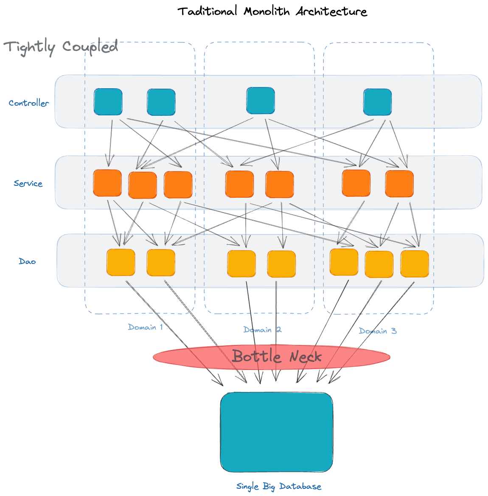
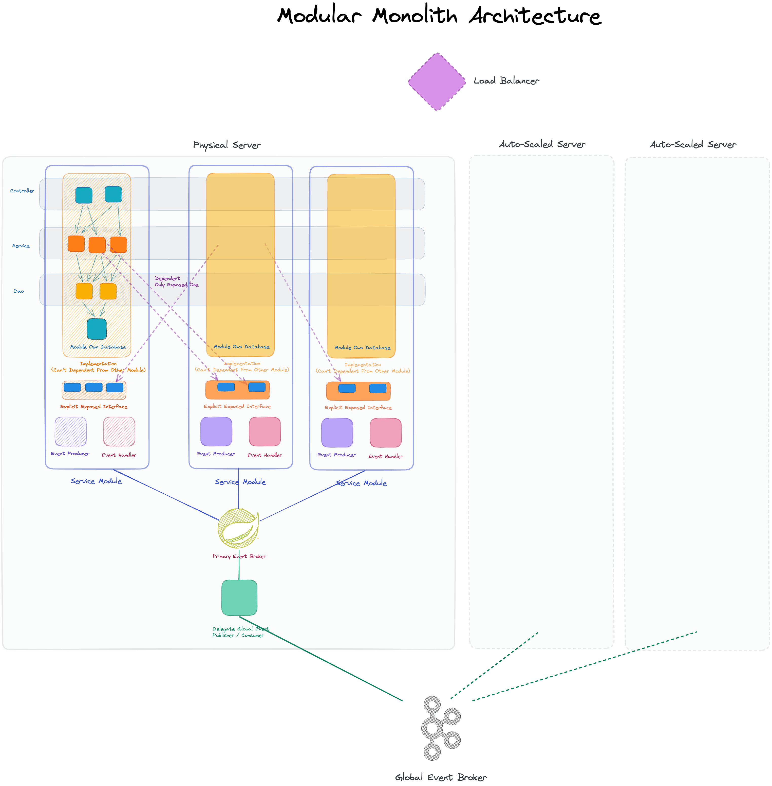

## 아키텍쳐 발전 계획
일단 첫 개발은 위에서 설명한 `Modular Monolith Architecture`구조로 만들고, 서비스가 커지거나 트래픽이 일정 수준을 넘으면, 아래의 계획에 따라 `MSA`로의 전환을 할 예정입니다.

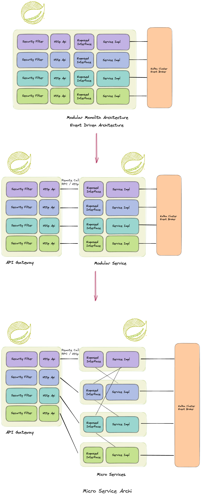

## 시작 아키텍쳐 (`Modular Monolith`)
- Modular Monolith Architecture
- Event Driven

이러한 아키텍쳐를 도입하기 위해서 `Spring Spring Modulith` 통해 모듈간 의도치 않은 의존성을 방지 할 예정입니다.

## 최종 아키텍처 (`MSA`) 서버 도메인 개요
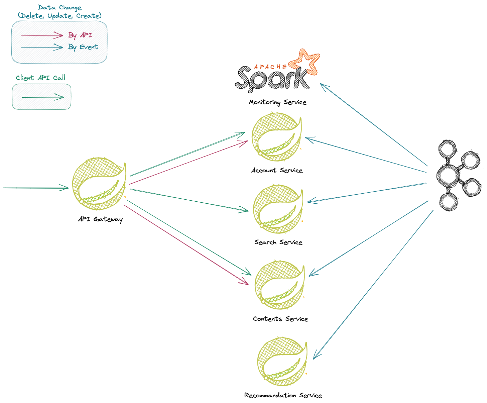

## 최종 목표 아키텍쳐 (`MSA`) 상세 설계
### Auth, Route, Session, Security
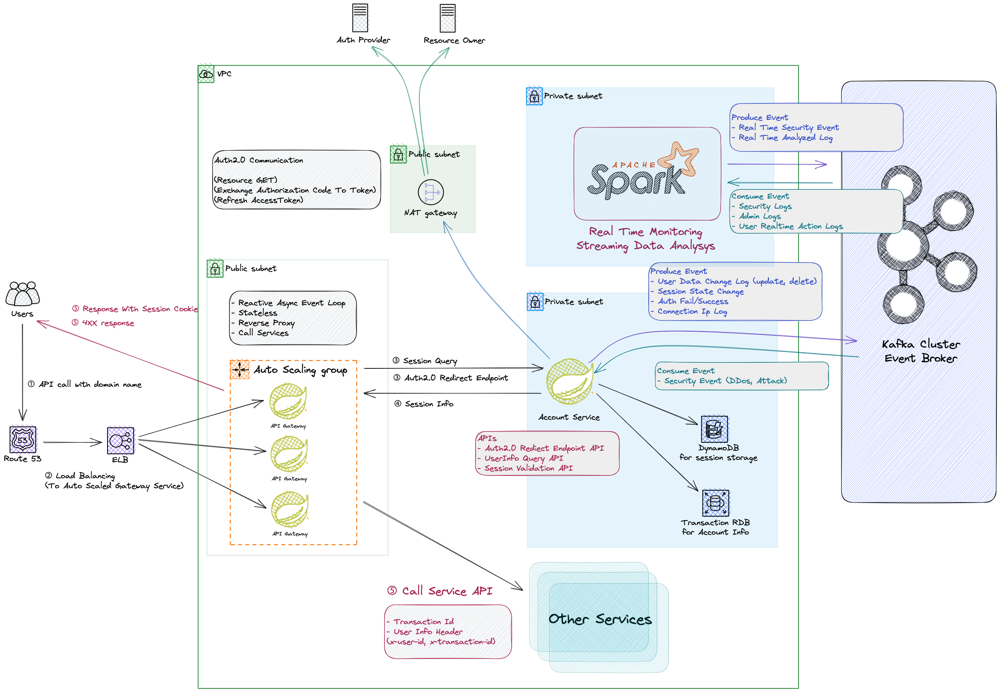
### Recommandation Service
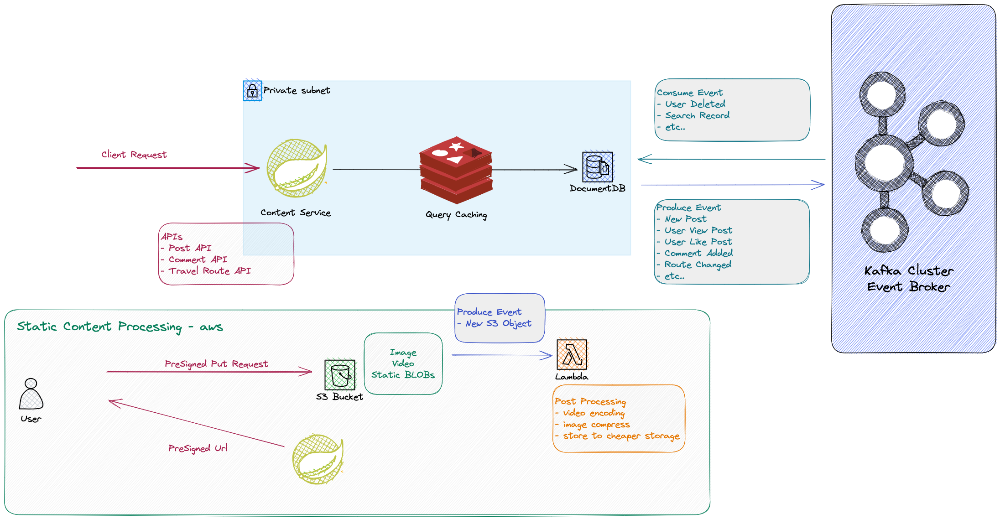
### Content Service
게시글, 댓글, 여행 콘텐츠

### Search Service
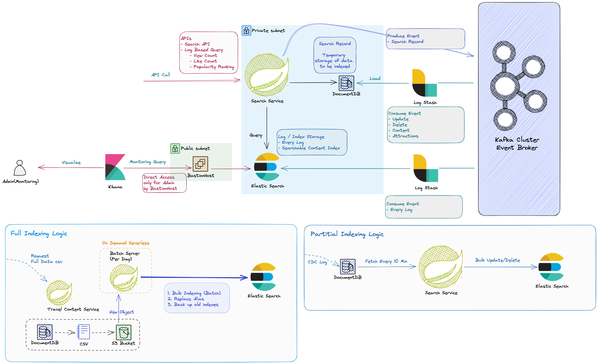

# Secondary Event Naming Rule
카프카에서는 토픽 이름을 바꿀 수가 없으므로, 일정한 컨벤션을 통해 명명하고자 합니다.

`<{Dataset Name}.{Data Name}>-<behavior>-<message_type>-<version>`

## Allowed Charactor
- `' - '`
- `' . '`

## Message Type
- `logging` : 로그 데이터, 시스템 로그, 모니터링 로그 등
- `queuing` : 전형적인 큐잉을 위한 사용
- `tracking` : 트래킹 하는 이벤트, statelss 한 이벤트, 주로 aggregation 에 사용된다.
- `changing` : 특정 데이터가 변경되었음을 나타낸다, stateful한 이벤트, 주로 cdc에 사용된다.
- `streaming` : 스트리밍 처리 파이프라인에 의해 생성된 중계 역할을 하는 토픽
- `push` : 배치성 데이터, 오프라인 쪽에서 수집된 데이터(IOT등)

## Dataset Name
이는 서버의 이름이나, 논리적으로 정해진 비즈니스 도메인을 통해 특정하면 안된다. (변경 가능성이 있다.)

주로 변하지 않는 도메인 이름 (전통적인 데이터베이스에서 데이터 베이스 이름)으로 작성해야한다. 

계층적으로 명명하는 것이 가능하다 이 경우 점('.')기호를 사용하자

## Data_Name
전통적인 데이터베이스에서 테이블 명에 해당되는 이름이다.

## behavior
이 이벤트가 무엇에 관한 이벤트인지 정의한다.

## Version
혹시나 이벤트의 페이로드가 바뀌게 될 경우, 자연스러운 전환을 가능하게 하기 위해 도입하였습니다.

# 명세서

## API Gateway
외부에서 호출 가능한 API

## Account Domain
[Account Domain HTTP API](./docs/readme/specification/account/api_spec.md)

[Event Spec](./docs/readme/specification/account/event_spec.md)

[SQL](./docs/readme/specification/account/account.sql)