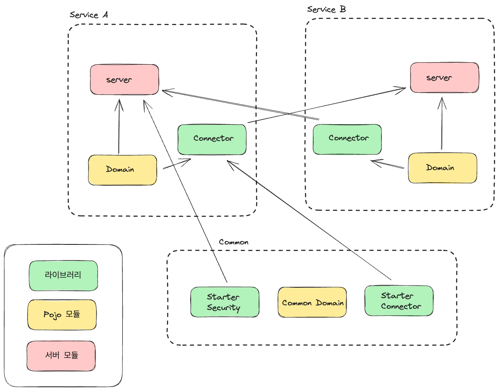

# Project - Managed Travel Service 🗺️

# ✏️ 서비스 소개
이 서비스는 추천 기반 여행 서비스 입니다.

- 실시간 여행지 추천
- 선택한 여행지 기반 최적 경로 제공
- 여행 정보 제공
- 여행 계획 시각화

일단 개발의 우선도를 나눴습니다. 빨간색으로 표시된 블럭은 서비스의 핵심기능으로, 최우선적으로 개발될 기능입니다.

비어있는 블럭은 향후 서비스의 확장을 고려하기 위해 그려놓았으며, 향후 서비스의 성장 방향성을 보여줍니다.

# ✏️ System Design
이 파트에서는 이 서비스를 구현을 위한 소프트웨어적 설계를 다룹니다.

## 현재 아키텍쳐

## 아키텍쳐 발전 히스토리

이 프로젝트는 다양한 아키텍처를 바꿔가면서 리팩토링 되었습니다. 변화 히스토리는 다음과 같습니다.
### 1. 모놀리스 아키텍쳐 
맨 처음에는 가장 기본이 되는 모놀리스 아키텍쳐로 설계를 시작하였습니다.
### 2. 모듈러 모놀리스 아키텍쳐
모놀리스 아키텍쳐를 사용한 기존 프로젝트에서 발생했던 문제를 고려하여 도입하였습니다.
- 코드간 의존성이 커져 유지보수가 힘들어짐
- 각 도메인간 바운더리가 명확하지 않아 협업 비용이 늘어남 

또한 마이크로 서비스로의 직접적인 전환시 다음과 같은 단점이 있을 것으로 예상했습니다.
- 배포, 운영의 복잡성
- 시스템 복잡성
- 러닝 커브

따라서 Spring Monolith 기반의 서버로 설계를 하였습니다. 그리고 추후의 MSA로의 전환을 고려하며 모듈을 설계하였습니다.

[System Design Detail - Modular Monolith](docs/readme/system_design/modular_design_detail.md)

### 3. MSA (Micro Service Architecture) + Event Driven Architecture
모듈러 모놀리스 아키텍쳐의 경우 몇가지 문제점이 있었습니다.
- Application Context의 Bean의 경우 완전한 분리가 힘듬
- 설정파일이나, 환경이 공유됨
- 완전히 모듈간 독립적인 개발이 힘듬
- Spring Monolith 프레임 워크의 성숙도가 매우 낮음(1.0.0)

이에 따라 해당 아키텍쳐가 가지는 장단점과 MSA가 가지는 장단점을 비교했을 때 전환이 필요하다고 생각하였습니다.
또한 이벤트 드리븐 아키텍쳐를 도입하여 각 서비스간 과도한 의존성이 생기지 않도록 설계하였습니다.

### [Modular Monolith To MSA](docs/readme/system_design/modular_monolith_to_msa.md)

### 4. 헥사고날 아키텍쳐의 엔티티 독립성 부분 차용
헥사고날 아키텍쳐, 클린 아키텍쳐에 일부분(엔티티를 도메인으로 매핑하여 의존성을 없애는 부분) 을 차용하여 조금더 개선시켰습니다.
### 5. gradle의 멀티 프로젝트 기능 활용하여 기능별 라이브러리화, 내부 모듈화
다음과 같은 중복 코드가 계속해서 늘어났습니다.
- 도메인 객체 재정의
- 호출 코드 재정의
- 보안 관련(토큰 파싱 등) 코드 무한 반복

이와 같은 코드 반복은 다음과 같은 상황에서 n-1개의 서버에서 해당 코드를 고쳐야 하는 문제가 있었습니다.(유지보수 힘듬)
- 도메인 객체의 변경
- API 엔드포인트 변경
- 보안 관련 코드의 복사 붙여넣기

이를 해결하기 위해 프로젝트를 멀티 프로젝트(멀티 모듈)로 변경을 하고, 모듈을 재설계 하였습니다.
- common 모듈을 분리하였습니다.
- 보안이나, 공통된 설정 코드는 Spring Boot의 AutoConfiguration 기능을 활용하여 SpringBoot-Starter 라이브러리를 만들었습니다.
- 각 도메인 별로 도메인, 커넥터(호출 SDK), 서비스(서버) 코드의 책임을 부과하여, API 의 변경이 다른 서비스의 코드를 변경시키는 문제를 막았습니다.

## Detail

### [System Design Detail - Modular Monolith](docs/readme/system_design/modular_design_detail.md)

### [Modular Monolith To MSA](docs/readme/system_design/modular_monolith_to_msa.md)

# ✏️ Specification

## 이벤트 명 컨벤션 정의
### [Event Naming](docs/readme/system_design/event_design_detail.md)

## Account Domain
[Account Domain HTTP API](./backend/services/account/specification/api_spec.md)

[Event Spec](./backend/services/account/specification/event_spec.md)

[Database DDL](./backend/services/account/database/account.sql)

# Major Versions
- kafka : 3.4.1 (confluent platform 7.4.3)
- spring boot : 3.1.4
- java : 17
- elasticsearch : 8.7.1
- spring data elasticsearch : 5.1.x
- postgresql : 16.0 with postgis extension
- hibernate core : 6.2.9