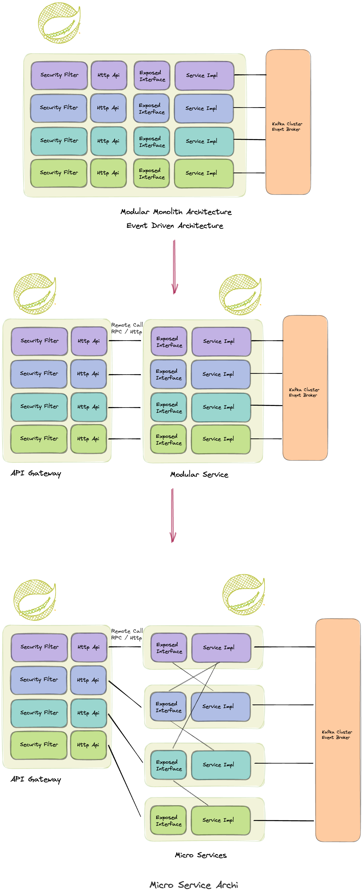

## 아키텍쳐 발전 계획
일단 첫 개발은 위에서 설명한 `Modular Monolith Architecture`구조로 만들고, 서비스가 커지거나 트래픽이 일정 수준을 넘으면, 아래의 계획에 따라 `MSA`로의 전환을 할 예정입니다.

## 시작 아키텍쳐 (`Modular Monolith`)
- Modular Monolith Architecture
- Event Driven

이러한 아키텍쳐를 도입하기 위해서 `Spring Spring Modulith` 통해 모듈간 의도치 않은 의존성을 방지 할 예정입니다.